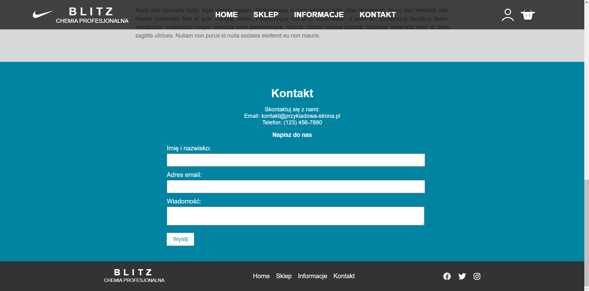
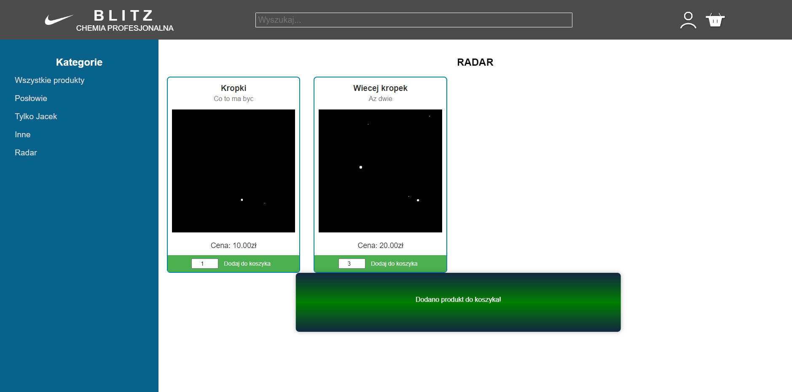
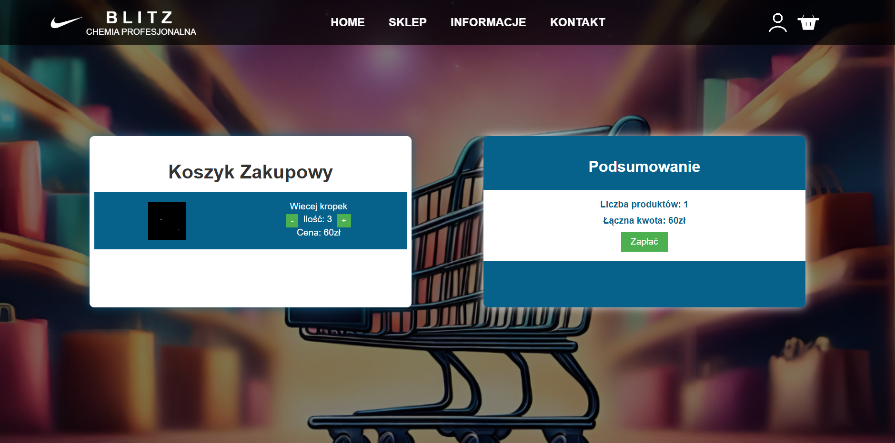
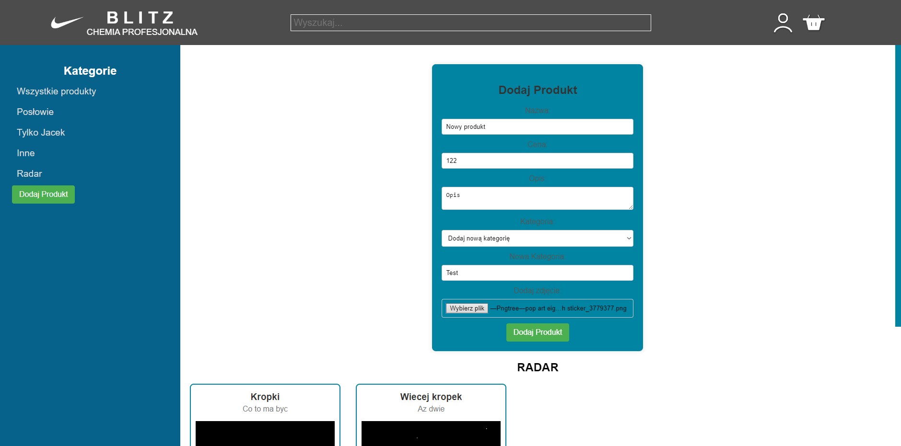
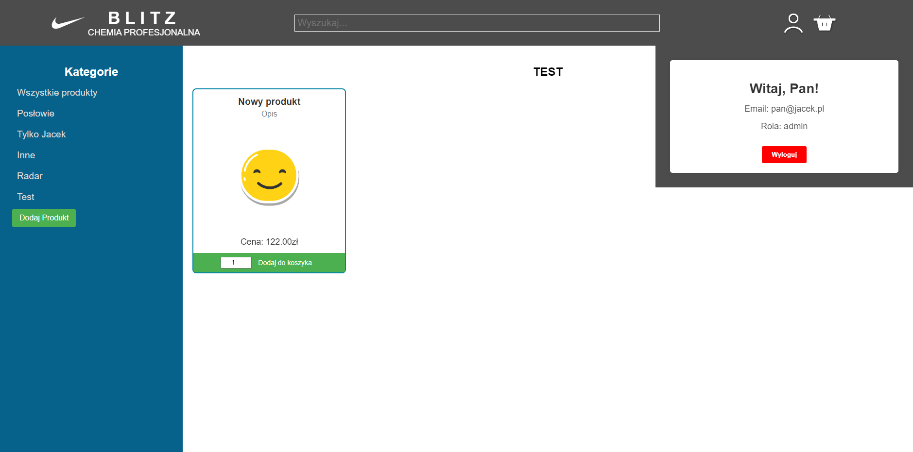

# Blitz

Blitz is a web application that allows users to browse products, log in, create accounts, add products (as an admin), and interact with the shopping cart.

## Technologies

- **Frontend:** HTML5, CSS3, JavaScript
- **Backend:** PHP
- **Database:** PostgreSQL
- **Containerization:** Docker, Docker Compose

## Features

1. **Browse Products:**
    - Customers can browse available products, sort them by category, price, etc.

2. **Login and Account Creation:**
    - Customers can create an account or log in to access additional features such as a shopping cart and order history.

3. **Add to Cart:**
    - Logged-in users can add products to the shopping cart.

4. **Adding Products (Admin):**
    - Administrators have the ability to add new products to the store.


## Running with Docker Compose

1. **Clone the Repository:**
   ```bash
   git clone https://github.com/sdarjusz/Blitz.git
   cd Blitz
   docker-compose build
   docker-compose up

## Screenshots

1. **Main Page:**
   

2. **Contact Form:**
   

3. **Registration Form:**
   

4. **Shop Page:**
   

5. **Shopping Cart:**
   

6. **Adding Product:**
   

7. **Added Product:**
   
